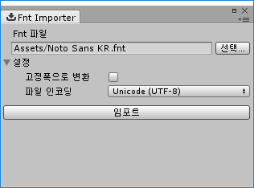

# Bitmap Font Importer for Unity UI

[Bitmap Font Generator](http://www.angelcode.com/products/bmfont/), [ShoeBox](http://renderhjs.net/shoebox/), [Littera](http://kvazars.com/littera/) 등의 비트맵 폰트 생성 도구로부터 만들어진 fnt 형식의 파일을 유니티 UI의 Text 컴포넌트에서 사용할 수 있는 폰트로 임포트하는 유니티 에디터 확장입니다. 유니티 5.4 이상에서 사용할 수 있습니다.

## 특징

- txt, xml, bin 형식의 fnt 파일 지원합니다.
- `packed` 형식의 폰트를 지원합니다.

## 제한

- 여러 장의 텍스처를 사용하는 폰트는 지원하지 않습니다.

## 설치

[릴리스 페이지](https://github.com/songkyoo/BitmapFontImporter/releases)에서 유니티 패키지 파일을 다운로드하여 프로젝트에 임포트하면 메뉴바의 Window 항목에 Bitmap Font Importer가 추가됩니다.

## 사용법

임포트하려는 fnt 파일을 `Fnt 파일` 필드로 드래그 하거나 `선택…` 버튼으로 파일 선택창을 열어 선택합니다. 프로젝트 내부/외부의 파일을 모두 지원합니다.

임포트 버튼을 클릭하고 폰트를 저장할 위치를 지정합니다. 폰트를 저장할 위치는 Assets 폴더 아래에 있어야 합니다. 지정한 위치에 폰트와 폰트가 사용하는 재질이 생성되고, fnt 파일 위치가 Assets 폴더 바깥인 경우 텍스처 파일도 임포트됩니다.

임포트된 폰트는 유니티 UI의 Text 컴포넌트에 설정해서 사용할 수 있으며 `packed` 형식인 경우 재질도 같이 설정해야 합니다. 임포트 시 생성되는 재질은 기본적으로 `UI/Default Font` 쉐이더가 설정되고 `packed` 형식인 경우 `Macaron/UI/Packed Bitmap Font` 쉐이더가 설정됩니다.

## 설정

<!-- markdownlint-disable MD033 -->
| 이름 | 설명 |
| --- | --- |
| 고정폭으로 변환 | 개별 문자의 폭과 커닝 정보를 무시하고 가장 넓은 문자의 폭을 모든 문자에 적용하여 임포트합니다. |
| 파일 인코딩 | 파일을 읽을 때 문자열에 적용할 인코딩입니다. 특정 익스포터로 익스포트된 파일이 텍스처 파일명에 한글과 같은문자를 포함한 경우 파일의 인코딩에 따라 올바른 값을 읽지 못하는 경우가 있습니다. 그런 경우 인코딩을 지정하여 파일을 읽어 문제를 해결할 수 있습니다. |
<!-- markdownlint-enable MD033 -->

## 참고

- 텍스처 파일은 fnt 파일과 같은 위치에 있어야 합니다.
- 임포트 시 기존 폰트를 덮어쓰는 경우 폰트의 내용은 갱신되지만 재질과 텍스처는 갱신되지 않습니다. 다만 폰트에 재질 혹은 텍스처가 설정되지 않았다면 새로 임포트하는 것과 같은 동작을 수행하며, 외부 파일인 경우 텍스처는 항상 복사되지만 임포터 설정을 변경하는 것은 재질에 텍스처가 설정되지 않은 경우 뿐입니다.
